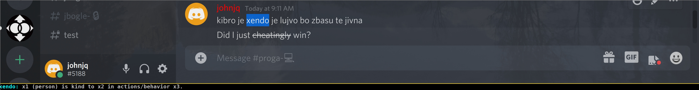
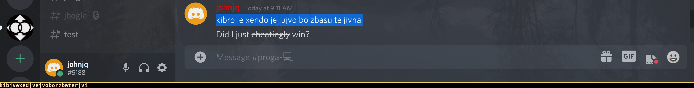

# jbozga

A simple status bar constantly displaying the Lojban definition for the currently selected word (for systems running X11 only).
Doubles as a lujvo-maker, as long as [jvozba](https://github.com/uakci/jvozba) is accessible on the PATH.

It works as follows:
1. The python script **jbozga-producer.py** constantly inspects the current X11 selection (using xclip), looks up the selection in the in-memory dictionary (built from a [jbovlaste](https://jbovlaste.lojban.org/) dump), and whenever an entry is found writes the definition to a named pipe (defaults to "$HOME/.jbozga_pipe").
    1. When the clipboard contains multiple words, the producer script attempts to build a lujvo by calling **jbozga** (it must be on the PATH).
2. An instance of [xmobar](https://github.com/jaor/xmobar) runs taking input from the named pipe.

## Running manually
You may run this project manually with the following steps:
1. Install xclip and xmobar. Both are readily available on the built-in package manager from most Linux distributions.
    1. Optionally install [jvozba](https://github.com/uakci/jvozba) as well, if you would like lujvo-making support.
2. Download a jbovlaste dump. For example: `curl -L "https://raw.githubusercontent.com/jqueiroz/jbovlaste-dumps/master/english/2020-11-02.xml" -o /path/to/jbovlaste.xml`
3. Run the producer script: `./jbozga-producer.py /path/to/jbovlaste.xml`
4. Start xmobar: `xmobar /path/to/xmobar-config.default.hs`

You may want to use your custom xmobar config instead of `xmobar-config.default.hs`.
For more information, please refer to the [xmobar documentation](https://xmobar.org/).

## Running with nix
Comming soon™

## FAQ
### Why is the font so small/large?
The font size is hardcoded in the default xmonad config. Try changing the "14" on the second line to a different value:
`{ font = "xft:Bitstream Vera Sans Mono:size=14:bold:antialias=true"`.

<!-- TODO: add gif screenshot? -->
